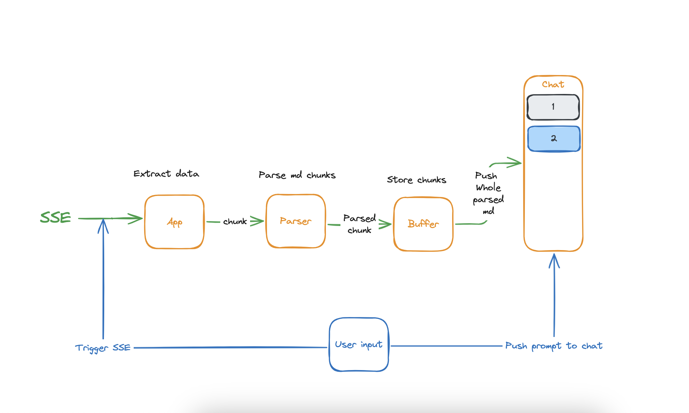

# Geppetto

**Geppetto** is a React-based project designed to progressively render Markdown text in real-time as it's streamed in chunks, such as through Server-Sent Events (SSE). With built-in support for complex Markdown structures, Geppetto ensures smooth, clean rendering by handling end-of-line and end-of-paragraph logic. This project follows an atomic design structure to maintain scalable and well-organized components.

A special thanks to **Thijs** for this assignment, which brought me back into the world of text processing and abstract syntax trees (AST). This experience has rekindled my interest for text processing and manipulation, and allowed me to explore convenient ways to manipulate texts in different formats, which was very enjoyable.

## Table of Contents

- [Tech Stack](#tech-stack)
- [Project Structure: Atomic Design](#project-structure-atomic-design)
- [Architecture & Data Flow](#architecture--data-flow)
- [Git Commit Message Naming Convention](#git-commit-message-naming-convention)
- [Testing Strategy](#testing-strategy)
- [Issues Encountered](#issues-encountered)
- [Installation](#installation)
- [Usage](#usage)
- [Room for Improvements](#room-for-improvements)

## Tech Stack

### UI

- **Typescript**: For type safety and enhanced development experience.
- **React**: Core library for building the user interface.
- **Tailwind CSS**: Utility-first CSS framework for creating responsive, custom designs quickly.

### Markdown Parsing

- **react-markdown**: Used to render Markdown as React components, making it simple to integrate Markdown in a React app.
- **remark plugins**: Enhances Markdown rendering capabilities with support for advanced formatting, such as embedded HTML and custom syntaxes.

### Testing

- **Vitest**: Fast and lightweight testing framework for running unit tests.
- **React Testing Library**: Helps with testing React components to ensure they behave as expected from a user's perspective.
- **Cypress**: End-to-end testing tool for simulating user interactions and verifying app functionality in a real browser environment.

## Project Structure: Atomic Design

Geppetto follows the **Atomic Design** methodology, a component-based structure that divides UI elements into three hierarchical categories to create consistent, reusable, and modular components. Here’s a brief overview of each level in the atomic design approach:

1. **Atoms**  
   The smallest building blocks in the UI. Examples include buttons, input fields, and icons. Atoms are highly reusable components that don’t typically depend on other components.

2. **Molecules**  
   Small combinations of atoms that work together as a single functional unit. Examples might include a ChatInput (input + button) or a ChatMessages with a collection of Messages. Molecules encapsulate simple functions but serve a unique purpose in the UI.

3. **Organisms**  
   Larger components made up of groups of molecules and/or atoms. Organisms define distinct sections of the interface, such as the Chatbot. They are more complex and provide a more complete UI element, usually with distinct functionality.

This structure allows for the efficient reuse of components, making the UI highly modular and scalable.

## Architecture & Data Flow

Geppetto’s architecture is designed to support real-time Markdown rendering through the progressive loading of text via Server-Sent Events (SSE). The core of the application is built using a component-based architecture that follows the **Atomic Design** principles, ensuring a scalable and maintainable structure.

### Data Flow

1. **SSE Connection**:

   - The app establishes an SSE connection with the server to receive Markdown data in chunks.
   - As chunks are received, each chunk is parsed immediately into a React component using `react-markdown` and relevant `remark` plugins.

2. **Progressive Rendering**:

   - Once chunks are parsed, they are appended to the rendered content, creating a seamless experience for the user.

3. **Buffering**:
   - A buffer is maintained to hold incoming chunks temporarily.
   - Parsed chunks are progressively added to the UI while remaining chunks stay in the buffer until they’re fully parsed.

This real-time data flow ensures that the user sees content progressively as it arrives, rather than waiting for the entire document to load.

Below you can find an explanatory figuree about how the application manages the data:


## Git Commit Message Naming Convention

For this project, I followed a clear and consistent naming convention for Git commit messages. The format I used is:

```
<type>[<scope>]: <message>
```

### Types:

- **feat**: A new feature or enhancement.
- **fix**: A bug fix or resolving an issue.
- **style**: Formatting changes (e.g., whitespace, code style).
- **refactor**: Refactoring code without changing functionality.
- **test**: Adding or modifying tests.
- **chore**: Miscellaneous tasks or maintenance.

### Example Commit Messages:

- `feat[markdown-parser]: implement real-time Markdown chunk parsing`
- `fix[sse-connection]: handle SSE connection close gracefully`
- `docs[readme]: update README with testing strategy`
- `refactor[components]: optimize rendering performance`

Following this convention helps maintain a clean and readable commit history, making it easier to track changes over time.

## Testing Strategy

The testing strategy for Geppetto ensures both individual functionality and user interactions are thoroughly validated.

### Unit Tests

Unit tests are written using **Vitest** and **React Testing Library**. These tests verify that individual components, such as the Markdown parser and buffer management, work correctly in isolation.

#### Example:

```bash
npm run test
```

### End-to-End Tests

End-to-end tests are implemented using **Cypress**. These tests simulate real user interactions, such as opening the app, streaming data through SSE, and interacting with parsed Markdown content.

#### Example:

```bash
npm run cypress:open
```

### Coverage

- **Component tests**: Ensure that each React component works correctly.
- **SSE and Parsing**: Simulate SSE events and test that chunks are parsed and rendered correctly.
- **UI Tests**: Validate user interaction, such as typing and clicking, to ensure the UI is responsive and functions as expected.

## Issues Encountered

During the development of Geppetto, I faced a few challenges:

1. **CORS Issue**:  
   The backend server was blocking cross-origin requests, preventing the frontend application from making requests and listening to the SSE stream. I resolved this by modifying the request headers to include the `Access-Control-Allow-Origin` header, allowing the frontend to access the server.

2. **Dirty Data from the Backend**:  
   The data coming from the backend was dirty markdown -not plain Markdown but a mix of HTML and Markdown-, which required some workaround to clean and sanitize the HTML embedded in the SSE chunks. This introduced some inconsistencies in the parsing process, as I had to manually extract the Markdown from the raw data and sanitize it, leading to occasional parsing issues.

**Note:** While a perfectly stable and reliable solution to these issues is very much feasible, it would require further tweaks on the backend. However, I chose not to make additional changes to the backend and instead focused on solving the issue from the frontend perspective, providing a solution that works well enough given the current limitations.

## Installation

Clone the repository and install dependencies:

```bash
git clone git@github.com:mo-jsx/gf-ai-chatbot.git
cd geppetto
npm install
```

## Usage

To start the development server, run:

```bash
npm run dev
```

Navigate to `http://localhost:5173` to see Geppetto in action.

## Room for Improvements

While **Geppetto** works well as is, there are several areas where the project could be further improved if given more time and resources. Some possible improvements include:

1. **Backend Tweaks for Better Stability**:

   - As mentioned in the **Issues Encountered** section, a more stable and reliable solution for parsing and sanitizing the Markdown data could be implemented by making changes to the backend. With more control over the data format coming from the server, we could ensure that the incoming chunks are clean, properly formatted, and easier to parse.

2. **Optimizing the Markdown Parsing**:

   - The current solution works, but for large-scale text documents, performance might be further optimized. We could introduce a more efficient parsing strategy, such as chunking the text more intelligently or using a more performance-oriented library for Markdown parsing.
   - Adding support for more complex Markdown elements (such as tables, footnotes, etc.) could improve the rendering experience for diverse types of Markdown content.

3. **Improved Error Handling**:

   - Adding more robust error handling and user-friendly error messages for cases where data is incomplete or corrupted during streaming. This could include retry mechanisms for SSE events or fallbacks when parsing fails.

4. **Refining Real-Time Rendering**:

   - Enhancing the progressive rendering experience by implementing smoother transitions or animations as text is appended, making the user experience feel more natural and responsive.
   - Implementing better handling for large chunks of data to avoid blocking the main thread, possibly by offloading parsing to web workers for smoother performance.
